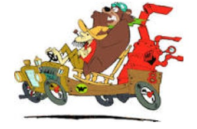

#  El alambique viajero

## Los Viajes de Luke

A Luke le gusta viajar por el mundo y traerse recuerdos. 
Suele ir en el "alambique veloz" pero en ocasiones cambia de vehículo.

Averiguar:
1. Cuántos lugares visitó Luke
2. El recuerdo que se trajo del último lugar que visitó

Para ello es necesario tener en cuenta:

Cuando viaja se trae un recuerdo típico del lugar visitado que conserva en un lugar destacado de su casa. El problema es que su casa es pequeña, por lo que tira el recuerdo que haya traído de algún viaje anterior. El vehículo utilizado para viajar sufre las consecuencias. Cuando pretende visitar una ciudad a la que no puede ir, simplemente no va. 

Se conocen los siguientes recuerdos:
- El recuerdo típico de París es un llavero de la torre eiffel.
- Buenos Aires tiene como recuerdo típico un mate, pero dependiendo de quién sea el presidente puede venir con yerba o no.
- El recuerdo típico de Bagdad va cambiando con los años, en algún momento pudo haber sido un bidón con petróleo crudo, alguna de las armas de destrucción masiva que nunca se encontraron o una réplica de los míticos jardines colgantes de Babilonia. O tal vez en el momento que viaje Luke sea otro diferente. 
- Las Vegas, mas que tener algo típico propio, hace "homenaje" a otros lugares. Por ejemplo, si es visitada cuando se está conmemorando a París, el recuerdo es también el llavero de la torre eiffel y si se estuviera recordando a Buenos Aires, sería el mate. 
- Cada viaje que hace el alambique veloz consume una cierta cantidad de combustible. 

Para poder ir a las ciudades, hay diferentes restricciones en las que interviene el vehículo que maneja Luke, que en principio es el Alambique veloz:
- París, tiene que tener suficiente combustible
- Buenos Aires, tiene que ser rápido
- Bagdad no hay restricciones
- Las Vegas: la misma restricción del lugar que se esté homenajeando 

Nuevos requerimientos:

Agregar otros vehículos que pueda usar Luke para viajar, en vez del Alambique Veloz. Definir su estado interno y su comportamiento con creatividad, de manera que a pesar de ser diferentes, puedan también ser usados por Luke para viajar de acuerdo a lo planteado anteriormente. Por ejemplo:
- El súper chatarra especial podría tener información de cañones o municiones, con lo cual se deduce su combustible que tenga.
- La Antigualla Blindada podria tener una cantidad de gangster variable, de lo cual depende que sea rápido o que se modifique cuando viaja.
- El SuperConvertible puede variar su comportamiento según en qué esté convertido

Crear un nuevo destino turístico.